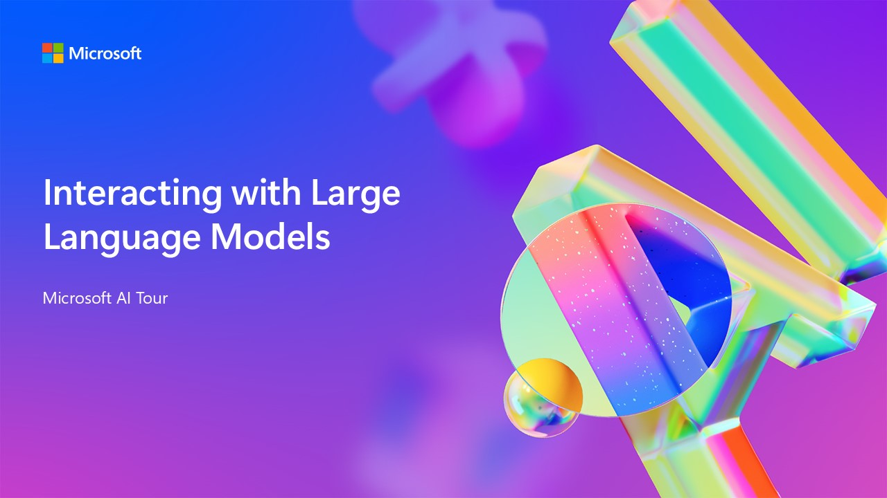

# Interacting with Multimodal models and Agents in Azure AI Foundry

 

This repository is for the AI Tour workshop: *Interacting with Multimodal models in Azure AI Foundry*

## Session Description

This workshop is designed to give you a hands-on introduction to the core concepts and best practices for interacting with OpenAI models in Azure AI Foundry portal. If you have been provided with a Skillable Environment, you'll be using the VM and pre-provisioned Azure resources provided to you to complete the lab. If you are running this workshop on your own, you will need to have an Azure subscription and provision the resources yourself by deploying the resources to Azure.

 

### Abstract

Innovate with Azure OpenAI's GPT-4o multimodal model in this hands-on experience in Azure AI Foundry. Learn the core concepts and best practices to effectively generate with text, sound, and images using GPT-4o-mini, DALL-E and GPT-4o-realtime. Create AI Agents that enhance user experiences and drive innovation.

### Duration
75 Minutes

### [Slide Deck](https://aka.ms/AAryqzi)

## Learning Outcomes
* Understand how Large Language Models work, including what tokens are​.
* Explore Prompt Engineering techniques and best practices​
* Understand how models apply existing knowledge​
* Get started with building an Azure AI Agents
* Implementing function calling in LLM applications​

## Technology Used
* Azure AI Foundry portal

## Workshop Instructions

The step by step workshop instructions can be found as follows:

- [Skillable Workshop Instructions](https://github.com/microsoft/aitour-interact-with-llms/blob/main/lab/Skillable%20Workshop%20Instructions/00_Introduction.md)
- [Workshop Instructions if you are deploying directly on Azure](https://github.com/microsoft/aitour-interact-with-llms/blob/main/lab/Workshop%20Instructions/00_Introduction.md) - for Field Stops

## Additional Resources and Continued Learning

| Resources          | Links                             | Description        |
|:-------------------|:----------------------------------|:-------------------|
| Session Slides | [View](https://aka.ms/AAryqzi) | Review the slides presented during the workshop at your own pace |
| Intro to Azure OpenAI Service  | [Microsoft Learn module](https://learn.microsoft.com/en-us/training/modules/explore-azure-openai/?WT.mc_id=aiml-132569-bethanycheum) | Learn more about Azure OpenAI Service |
| Azure OpenAI Service documentation  | [Azure OpenAI Service documentation](https://learn.microsoft.com/en-us/azure/cognitive-services/openai/?WT.mc_id=aiml-132569-cacaste) | Learn more about Azure OpenAI Service |
| Azure OpenAI Service pricing  | [Pricing details](https://learn.microsoft.com/en-us/training/modules/explore-azure-openai/?WT.mc_id=aiml-132569-bethanycheum) | Learn more about Azure OpenAI Service pricing |
| Transparency Note for Azure OpenAI Service  | [Transparency Note](https://learn.microsoft.com/en-us/legal/cognitive-services/openai/transparency-note/?WT.mc_id=aiml-132569-bethanycheum) | Learn more about Azure OpenAI Service use cases, capabilities and limitations |

## Content Owners
<!-- TODO: Add yourself as a content owner
1. Change the src in the image tag to {your github url}.png
2. Change INSERT NAME HERE to your name
3. Change the github url in the final href to your url. -->

<table>
<tr>
    <td align="center"><a href="http://learnanalytics.microsoft.com">
         
        <b> Gustavo Cordido
</b></a> 
            <a href="https://github.com/gcordido" title="talk">📢</a> 
    </td>
    <td align="center"><a href="http://learnanalytics.microsoft.com">
         
        <b>Bethany Jepchumba
</b></a> 
            <a href="https://github.com/bethanyjep" title="talk">📢</a> 
    </td>
</tr></table>

## Responsible AI 

Microsoft is committed to helping our customers use our AI products responsibly, sharing our learnings, and building trust-based partnerships through tools like Transparency Notes and Impact Assessments. Many of these resources can be found at [https://aka.ms/RAI](https://aka.ms/RAI).
Microsoft’s approach to responsible AI is grounded in our AI principles of fairness, reliability and safety, privacy and security, inclusiveness, transparency, and accountability.

Large-scale natural language, image, and speech models - like the ones used in this sample - can potentially behave in ways that are unfair, unreliable, or offensive, in turn causing harms. Please consult the [Azure OpenAI service Transparency note](https://learn.microsoft.com/legal/cognitive-services/openai/transparency-note?tabs=text) to be informed about risks and limitations.

The recommended approach to mitigating these risks is to include a safety system in your architecture that can detect and prevent harmful behavior. [Azure AI Content Safety](https://learn.microsoft.com/azure/ai-services/content-safety/overview) provides an independent layer of protection, able to detect harmful user-generated and AI-generated content in applications and services. Azure AI Content Safety includes text and image APIs that allow you to detect material that is harmful. Within Azure AI Foundry portal, the Content Safety service allows you to view, explore and try out sample code for detecting harmful content across different modalities. The following [quickstart documentation](https://learn.microsoft.com/azure/ai-services/content-safety/quickstart-text?tabs=visual-studio%2Clinux&pivots=programming-language-rest) guides you through making requests to the service.

Another aspect to take into account is the overall application performance. With multi-modal and multi-models applications, we consider performance to mean that the system performs as you and your users expect, including not generating harmful outputs. It's important to assess the performance of your overall application using [Performance and Quality and Risk and Safety evaluators](https://learn.microsoft.com/azure/ai-studio/concepts/evaluation-metrics-built-in). You also have the ability to create and evaluate with [custom evaluators](https://learn.microsoft.com/azure/ai-studio/how-to/develop/evaluate-sdk#custom-evaluators).

You can evaluate your AI application in your development environment using the [Azure AI Evaluation SDK](https://microsoft.github.io/promptflow/index.html). Given either a test dataset or a target, your generative AI application generations are quantitatively measured with built-in evaluators or custom evaluators of your choice. To get started with the azure ai evaluation sdk to evaluate your system, you can follow the [quickstart guide](https://learn.microsoft.com/azure/ai-studio/how-to/develop/flow-evaluate-sdk). Once you execute an evaluation run, you can [visualize the results in Azure AI Foundry portal ](https://learn.microsoft.com/azure/ai-studio/how-to/evaluate-flow-results).
