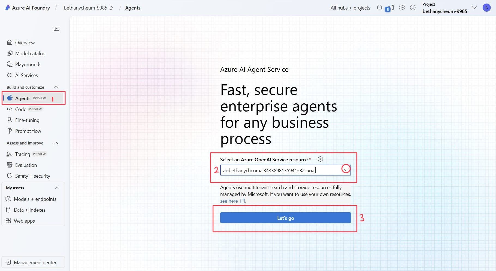

# Part 4 - Azure AI Agents

Welcome to Part 4 of this workshop! 

So far, we have interacted with Large Language Models in many different ways. However, these interactions have been isolated and tied to a very specific purpose. **Azure AI Agents** represent the next step in our interactions, as they help us integrate previous interactions into one solution.


> [!TIP] 
> **What is an Azure AI Agent?**  is a fully managed service designed to empower developers to securely build, deploy, and scale high-quality, and extensible AI agents without needing to manage the underlying compute and storage resources. It integrates capabilities such as state management, context association, chat threads, and code execution, making it easier to access third-party extensions​.

Previously, building custom AI Agents needed heavy lifting even for experienced developers. While the chat completions API is lightweight and powerful, it's inherently stateless, which means that developers had to manage conversation state and chat threads, tool integrations, retrieval documents and indexes, and execute code manually.

Within Azure AI Foundry, an AI Agent acts as a "smart" microservice that can be used to answer questions (RAG), perform actions, or completely automate workflows. It achieves this by combining the power of generative AI models with tools that allow it to access and interact with real-world data sources.

Agents can also access multiple tools in parallel, if needed. Some of these tools include:
- **Function Calling**
- **Code Interpreter**
- **File Search**
- **Grounding with Bing Search**
- **Azure Functions** and more..

In this section, we will be covering Code Interpreter.

## Understanding the Components of Agents

To begin working with Azure AI Agents, it is important to understand and address the different components that take part in its functionality.

As we now know, an **Agent** is simply a "smart" micrososervice that can peform actions, automate workglows or answer questions using RAG.

The next step once the Agent has been created, is to create a **Thread**. A **Thread** is a conversation session between an Agent and a user. Threads store Messages and automatically handle truncation to fit content into a model’s context.

The **Messages** are created by either the Agent or an user, include text, images and other files. These are stored as a list on the thread.

Lastly, we can **Run** the Agent. This means activating an Agent to begin running base on the contents of the Thread. The Agent uses its configuration and the *Thread’s Messages* to perform tasks by calling models and tools. As part of a Run, the Agent *appends Messages to the Thread*.

## Creating the Agent

1. Under _Build and customize_ on the left navigation bar, select **Agents.** In the page that just opened up, click on the down arrow to select you Azure OpenAI Service resource then select the **Let's go** button.



2. A new Agent will already be created for you. In the **Deployments** section, ensure you select **gpt-4o-mini** model.

    >[!TIP] 
    > **Ensure that you chose the correct deployment**. It should say **gpt-4o-mini** along with its version. 

4. Next, let's name our Agent. Type the following in the Agent Name textbox:

    ```Contoso Outdoor Sales Agent```

3. Next, we can provide the Agent with an **instruction**. Similar to the *System Message* we saw in previous sections, it provides the Agent with goals to follow. Navigate to the **Prompt** tab and copy the following instructions into the Instructions textbox.

    ``` 
    You are a sales Agent for Contoso Outdoor. You are polite, professional, helpful and friendly.

    You get all the sales data from the uploaded .csv files. There is sales revenue data that is broken down by region, product category, product type and separated by year and month.

    Examples of regions include Africa, Asia, Europe and America. Categories include climbing gear, camping equipment, apparel and others. Product categories include jackets, hammocks, wet suits, shoes and more. 

    If a question is not related to sales or you cannot answer the question, you **must** respond: "Please contact IT for more assistance". If the user asks for help or says 'help', provide a list of sample questions that you can answer.
    ```

    

    >[!NOTE]
    >How many prompt engineering techniques from the previous sections are you able to identify in this prompt? For clues, check Part 2 of the workshop.

4. Navigate to the **Actions** tab, and click **add.** 

    

5. A new tab where you will select **Code interpreter**.

6. On the next window, click on **select local files** and select the `Contoso_Sales_Revenue.csv` file on your Desktop.
    

    >[!NOTE]
    > If you cannot find the file on your desktop, you can download it from [here](assets/Contoso_Sales_Revenue.csv).

7. Click on the **upload and add** button. You should now see the file under the *Code Interpreter* tool.

The Agent is now ready for us to interact with it.

## Interacting with our Agent

1. On the top right of our Agents window, select **Try in playground**


2.  Let's begin by typing `help` in the chat box. You will notice this starts a New Thread. 
You will notice that we get a series of sample questions that we can test. Test one of the questions and see what the Agent replies!

2. Next, let's try a specific query. Type the following:

    ```What are the total sales for Europe broken down by category? ```

    You will notice the Agents makes use of the code interpreter to provide you with an answer.

3. Now, let's try working with this data. Type the following prompt:

    ```Put this data in a graph. ```

    Through code interpreter, the Agent is able to convert the structured data into a graph!

4. If you would like to see another type of graph, try the following prompt and request the data to be in a graph:

    ```What is the trending product category? Give the output as a graph. ```

    The Agent should provide you with a graph showcasing a trending product by carrying out an analysis of the sales revenue data overtime.

Congratulations! You have now completed the last part of the workshop and have learnt what Azure OpenAI Agents are, how they work and how to create one using Azure AI Foundry portal.

Click **Next** to advance to the Summary section of the workshop.