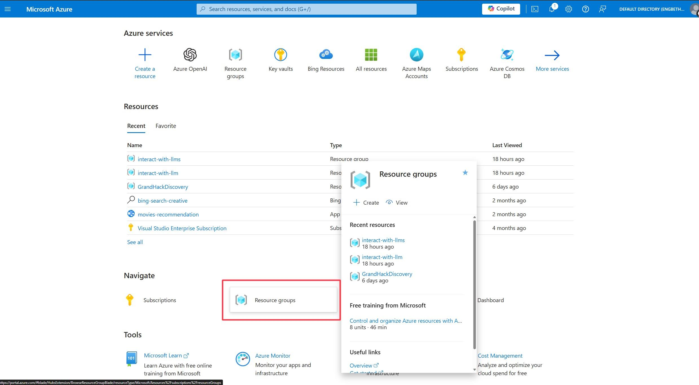
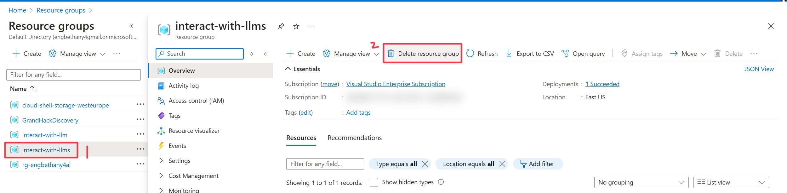
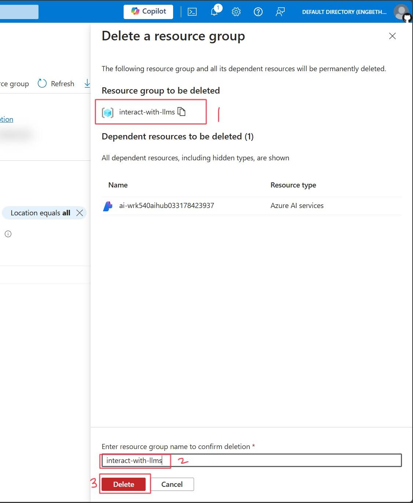
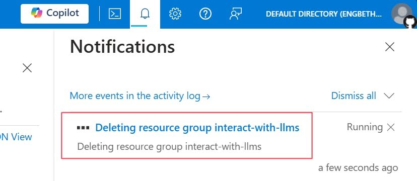

# Summary
Well done! You made it to the end of the workshop and successfully built an e-commerce website design for Contoso Outdoor Company, leveraging the power of generative AI.

## Clean up Resources

Once you're finished with the tutorial, you might want to delete all resources you created. You can delete the resource individually, or you can delete the entire resource Group.

1. Browse to the [Azure Portal](https://portal.azure.com).
2. From the homepage, navigate to **Resource groups** and select the resource group we create: **interact-with-llms**.

3. At the resource group top navigation panel, select **Delete resource group**

4. You will be prompted to enter the resource group name to confirm its deletion. Add the name **interact-with-llms** the click **Delete** to delete your resource group.

5. You will get a notification on your resource group being deleted.

## Some key points to remember
- Generative AI models can generate human-like text, images, and code
- Generative AI models are stateless: they do not learn, and are constrained by their training data which is frozen at a fixed point in time
- Azure OpenAI Service is a managed service that provides access to state-of-the-art natural language generative AI models, including GPT-4, GPT-4 turbo and GPT-4o from OpenAI with the security and enterprise promise of Azure.
- Azure AI Foundry is Azure's unified AI platform representing the Azure AI portal and unified SDK experiences in addition to pre-built app templates and access to 3P ISV tools and services.
- Prompt engineering is a technique for "grounding" generative AI models, and can be used to influence the style of a model's output, provide factual information, and constrain unintended behavior.
- Azure AI Agents are a new feature that makes it easier for developers to create applications with sophisticated copilot-like experiences that can sift through data, suggest solutions, and automate tasks by integrating tools.

## Additional Resources
Here are a few resources to help you take that next step in learning more about Azure OpenAI Service and Azure AI Foundry:

- Microsoft Learn module: [Intro to Azure OpenAI Service](https://learn.microsoft.com/en-us/training/modules/explore-azure-openai/?WT.mc_id=aiml-132569-cacaste)
- [Azure OpenAI Service documentation](https://learn.microsoft.com/en-us/azure/cognitive-services/openai/?WT.mc_id=aiml-132569-cacaste)
- [Azure OpenAI Service pricing](https://azure.microsoft.com/en-us/products/cognitive-services/openai-service/#pricing/?WT.mc_id=aiml-132569-cacaste)
- The [Transparency Note for Azure OpenAI Service](https://learn.microsoft.com/en-us/legal/cognitive-services/openai/transparency-note/?WT.mc_id=aiml-132569-cacaste) provides details on the capabilities, use cases and limitations of Azure OpenAI models.
- [Getting started with Azure AI Foundry and implementing the RAG pattern](https://learn.microsoft.com/training/paths/create-custom-copilots-ai-studio//?WT.mc_id=aiml-132569-cacaste)
- [Getting Started with Azure AI Agents](https://learn.microsoft.com/en-us/azure/ai-services/agents/overview)
