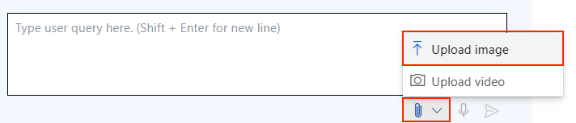
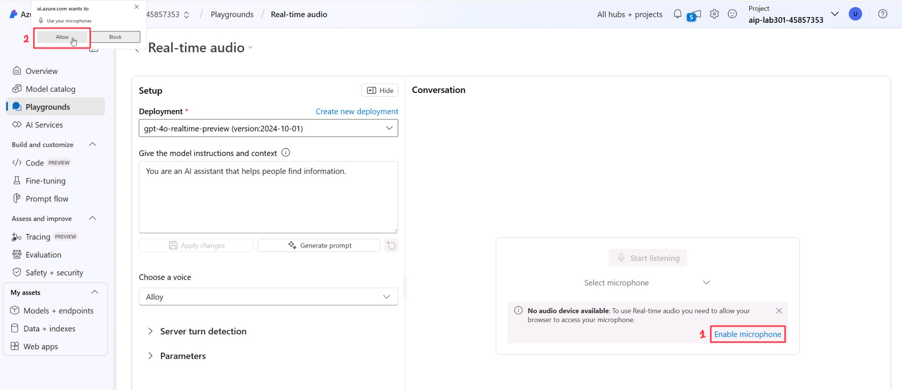

# パート3 - マルチモーダル

これまで、私たちは1つのモダリティを使用してLLMとやり取りしてきました。つまり、テキストを入力し、テキストまたは画像を受け取る形です。しかし、マルチモーダルインターフェースは、テキスト、画像、音声など複数のモダリティを利用してモデルとやり取りできるため、ますます人気が高まっています。これにより、人間とコンピュータのインタラクションが向上します。このセクションでは、**GPT-4o mini**および**GPT-4o audio**を使用してマルチモーダルインターフェースとやり取りする方法を探ります。

> [!TIP]  
> **GPT-4o mini**は自然言語処理と視覚理解の両方を組み込んだマルチモーダルモデルです。テキストと画像の組み合わせを入力として処理し、両方のモダリティに関連する出力を生成することができます。

**GPT-4o realtime**は、低遅延の「音声入力、音声出力」による会話型インタラクションをサポートしています。これは、カスタマーサポートエージェント、音声アシスタント、リアルタイム翻訳者など、ユーザーとモデル間のライブインタラクションを含むユースケースに最適です。

## ベストプラクティス

- **コンテキストの具体性**: 現在のシナリオにコンテキストを追加することで、モデルが適切な出力を理解しやすくなります。この具体性のレベルは、関連する側面に焦点を当て、不要な詳細を避けるのに役立ちます。

- **タスク指向のプロンプト**: 特定のタスクに焦点を当てることで、モデルがその視点を考慮しながら出力を生成しやすくなります。

- **出力フォーマットの定義**: 出力の希望フォーマットを明確に指定します。例えば、Markdown、JSON、HTMLなど。また、特定の構造、長さ、または応答に関する特定の属性を提案することもできます。

- **拒否への対応**: モデルがタスクを実行できないことを示した場合、プロンプトを調整することで効果的な解決策となることがあります。より具体的なプロンプトが、モデルの理解を明確にし、タスクの実行を改善します。以下のポイントを考慮してください：
    - 生成された応答の説明を求め、モデルの出力の透明性を高める
    - 単一画像プロンプトを使用する場合、画像をテキストの前に配置する
    - モデルに画像を最初に詳細に説明させ、その説明から特定のタスクを完了させる

- **プロンプトチューニング**: 以下のようなテキスト生成シナリオで探求したプロンプトチューニング技術を試してみてください：
    - リクエストを分割する（例：思考の連鎖）
    - 例を追加する（例：少数ショット学習）

## 画像を使用したモデルとのやり取り

1. **playgrounds**セクションに移動し、**Try the Chat Playground**を選択します。

>[!alert] 開始する前に、**Clear Chat**をクリックして、以前のやり取りのコンテキストをクリアしてください。

2. チャットのテキストボックスで、添付アイコンをクリックしてローカル画像をアップロードします。



3. デスクトップ上の```house-multimodal```フォルダ内のすべての画像を選択します。  
4. ファイルをアップロードしたら、以下のプロンプトを試して画像とやり取りを始めてください：

```
Create a tagline and short description for this rental home advertisement.
- The first picture is from the home
- The other pictures are from sights nearby
- In the description use the features of the house and make the ad more compelling with the sights. 
- Do not talk about features not visible in the images.
- If you have information about the location of the images, use that information in the description
```

## コンテキストの提供

次のデモでは、遮られた画像を使用します。この画像には、完全なコンテキストを隠すためにバウンディングボックスが意図的に追加されています。

1. _Clear the chat_ を実行し、チャットのテキストボックスに次のプロンプトを追加します：``what is that?``  
2. 添付アイコンをクリックし、デスクトップフォルダに移動して[context-001](./Images/context-001.png)画像をアップロードし、プロンプトを送信します。

> 「これが何か教えてください」と聞かれた場合、このテキストを特定するのは難しいかもしれません。これは、光学文字認識における古典的なコンピュータビジョンの課題を示しています。つまり、不明瞭で孤立した単語を解読することです。gpt-4o-miniを使用して「これが何か教えてください」と尋ねた場合、「手書きのスタイルのため、テキストは明確に読み取れません。“Mark”のようなものかもしれません。」と応答します。また、「テキストの一部がブロックされており、読み取ることができません」とも指摘します。

3. 新しい画像を追加します。デスクトップフォルダに移動して[context-002](./Images/context-002.png)画像をチャットにアップロードし、プロンプト```Extract all the texts from the image. Explain what you think this is.```を送信します。

> 少し詳細が明らかになりましたが、まだそれが何であるかを特定するのは非常に難しいです。この時点でプロンプトを少し調整し、「画像からすべてのテキストを抽出してください。これが何であるかを説明してください。」と尋ねます。gpt-4o-miniは、「これは“milk, steak”と書かれており、買い物リストのようです。」と応答しました。また、画像がまだ部分的に隠されていることを指摘しており、非常に興味深いです。

4. 最後の画像を追加します。デスクトップフォルダに移動して[context-003](./Images/demo-4-context-003.png)画像をチャットにアップロードし、プロンプト```Extract all the texts from the image. Explain what you think this is.```を送信します。

> 画像全体を明らかにすると、gpt-4o-miniが正しいことが分かります。それは実際に買い物リストです。「mayo」や「organic bread」のような項目を正確に特定します。さらに興味深いのは、下部のメモの解釈です。「ビールの項目に関するメモは、注意喚起や量を制限することを示唆している」と述べ、微妙なコンテキストを捉えています。

## リアルタイム音声インタラクション

**gpt-4o-realtime-preview**モデルを統合することで、ユーザーは音声コマンドを使用してプラットフォームとやり取りでき、買い物体験がより魅力的でアクセスしやすいものになります。

1. **Playgrounds**に戻り、**try Real-time audio playground**を選択し、デプロイメントを**gpt-4o-realtime-preview**に設定します。

2. **model instructions box**を次の内容で更新します：

    ```You are a pirate, and every response must be full of pirate lingo. ```

3. プレイグラウンドで、**enable microphone**をクリックします。ポップアップが表示されたら、許可をクリックして音声でのやり取りを有効にします。



4. **start listening**ボタンをクリックしてモデルとやり取りを開始し、「`hello`」と言って、モデルにいくつかの事実を尋ねてみてください。

5. 次に、システムメッセージを次のように変更して、再度モデルとやり取りしてください：

```You are a valiant medieval knight. Every response should echo the chivalry, honor, and grandeur of the court. Speak with formality and grace, as if addressing kings, queens, and noble warriors.```

## 次のステップ

おめでとうございます！これでラボの第3部を完了し、マルチモーダルモデルとのやり取り方法を学びました。

**Next**をクリックしてAzure AI Agentsセクションに進んでください。

**免責事項**:  
この文書は、AIによる機械翻訳サービスを使用して翻訳されています。正確さを追求しておりますが、自動翻訳には誤りや不正確さが含まれる可能性があることをご了承ください。元の言語で記載された原文が正式な情報源と見なされるべきです。重要な情報については、専門の人間による翻訳を推奨します。この翻訳の使用に起因する誤解や解釈の誤りについて、当社は一切の責任を負いません。