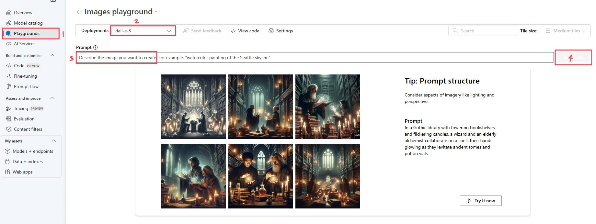

# Part 2: 이미지 생성

워크숍의 두 번째 파트에 오신 것을 환영합니다. 이번에는 텍스트-이미지 모델인 DALL-E 3와 상호작용해 보겠습니다.

> [!TIP]  
> DALL-E 3란 무엇인가요? DALL-E 3는 **자연어 입력**으로부터 그래픽 데이터를 생성할 수 있는 신경망 기반 모델입니다. 쉽게 말해, DALL-E 3에 **설명**을 제공하면 해당 설명에 맞는 이미지를 생성할 수 있습니다.

## 첫 번째 이미지 생성하기

첫 이미지를 생성하려면 다음 단계를 따르세요:



1. 왼쪽 탐색 메뉴에서 **Playgrounds**로 이동한 후, **Try the Image Playground**를 선택하세요.
2. Images Playground에서 **Deployments**라는 드롭다운 메뉴를 찾아 클릭하세요. 드롭다운 목록에서 **dall-e-3**을 선택합니다.
3. Images Playground에서 _"Describe the image you want to create."_라는 텍스트 상자를 찾으세요. 아래 제공된 프롬프트 예제에서 "T"를 클릭하면 (예: ``here is a sample prompt``) 현재 커서 위치에 자동으로 입력됩니다.
5. 메시지를 입력하면 **Generate** 버튼이 나타납니다. 버튼을 클릭하여 이미지 설명을 모델 배포에 제출하세요.
6. 쿼리를 전송한 후, 모델이 처리하고 응답할 때까지 잠시 기다리세요. 응답은 입력 아래 창에 표시됩니다.

기본적인 프롬프트를 설명 상자에 입력하고 Generate 버튼을 클릭하여 이미지를 생성해 봅시다:

```a watercolor painting of Chicago skyline```

이렇게 하면 다음과 같은 결과물이 생성됩니다:


DALL-E 3가 생성하는 이미지는 모두 독창적입니다. 이 이미지는 큐레이션된 이미지 카탈로그에서 가져오는 것이 아닙니다. 즉, DALL-E 3는 적절한 이미지를 검색하는 시스템이 아니라, 학습된 데이터에 기반하여 새로운 이미지를 생성하는 인공지능(AI) 모델입니다.

### 구체적으로 설명하기

세부적인 설명은 더 정확한 응답을 얻는 데 도움이 됩니다. 텍스트 생성과 마찬가지로, 이미지 생성 모델도 생성하고자 하는 이미지에 대한 자세한 설명을 제공하면 더 좋은 결과를 얻을 수 있습니다.

1. 예를 들어, 다음 프롬프트를 입력해 보세요:

    ```A logo for an adventure brand```

2. 그런 다음 **Generate**를 선택하고 생성된 이미지를 확인하세요.

    

3. 이제 설명에 더 많은 세부사항을 추가하여 프롬프트를 수정해 봅시다:

    ```A logo combining a tent silhouette and stars, with a rustic feel for an adventure brand.```

4. 다시 **Generate**를 선택하고 결과를 비교해 보세요.

    

### 모범 사례

DALL-E 3를 사용하여 효과적이고 정확한 이미지를 생성하려면 다음 모범 사례를 따르세요:

1. **명확하고 구체적인 프롬프트 작성**: 텍스트 프롬프트를 명확하고 상세하게 작성하세요. 설명이 구체적일수록 DALL-E 3가 요청에 맞는 이미지를 생성할 가능성이 높아집니다. 주제, 동작, 환경, 스타일, 그리고 중요한 세부사항을 포함하세요.

1. **형용사 활용**: 형용사와 부사를 사용하여 이미지가 전달하길 원하는 품질, 감정, 특성을 묘사하세요. 이를 통해 생성된 이미지를 더 정확하게 조정할 수 있습니다.

1. **세부사항과 단순함의 균형**: 세부사항은 중요하지만, 지나치게 복잡하거나 모순된 프롬프트는 AI를 혼란스럽게 하여 예상치 못한 결과를 초래할 수 있습니다. 설명에 필요한 맥락을 제공하면서도 간결하게 유지하세요.

1. **다양한 스타일 실험**: 특정 미학을 원한다면 예술적 스타일이나 영향을 명시하세요. 예를 들어, 예술적인 이미지를 요청할 수 있습니다.

1. **반복적 접근법**: 처음 생성된 이미지가 완벽하지 않을 수 있습니다. 이를 시작점으로 삼아 출력물을 기반으로 프롬프트를 반복적으로 수정하여 원하는 결과에 가까워지세요.

1. **비율과 구성**: 이미지의 구성이나 비율에 대한 선호도가 있다면 프롬프트에 포함하세요. 예를 들어, 가로로 된 이미지를 요청하거나 피사체가 중심에서 벗어난 초상화를 요청할 수 있습니다.

1. **문화적 및 맥락적 참조**: 적절하다면 문화적 또는 역사적 참조를 포함하여 이미지 생성 과정을 안내할 수 있는 추가적인 맥락을 제공하세요.

1. **책임 있는 AI 고려사항**: 프롬프트의 책임 있는 AI 사용을 염두에 두세요. 공격적이거나 고정관념을 강화하거나 저작권을 침해하는 이미지를 생성하지 않도록 주의하세요.

1. **테스트와 학습**: 다양한 프롬프트를 실험하여 DALL-E 3가 다양한 설명을 어떻게 해석하는지 이해하세요. 이를 통해 프롬프트의 정확성을 점진적으로 개선할 수 있습니다.

1. **가이드라인 준수**: OpenAI의 사용 사례 정책과 콘텐츠 가이드를 준수하며 프롬프트를 작성하세요. OpenAI 콘텐츠 정책에 따라 허용되지 않는 이미지를 요청하지 마세요.

## 브랜드 마스코트 생성

이번 워크숍에서는 DALL-E 3의 기능을 활용하여 브랜드 마스코트를 생성할 것입니다. 이를 위해 친근한 동물, 로봇, 추상적인 형태 등 다양한 테마를 중점적으로 다룰 것입니다.

또한 DALL-E 3의 다양한 매개변수를 테스트하여 생성된 이미지의 다재다능함을 탐구할 것입니다. 이 매개변수에는 다음이 포함됩니다:

- **이미지 크기:** 크기(예: 정사각형, 가로, 세로)를 다양하게 실험하여 캠페인에서 마스코트 디자인과 활용성에 미치는 영향을 이해합니다.
- **이미지 스타일:** 자연스럽거나 생동감 있는 스타일 등 다양한 스타일을 실험하여 브랜드의 개성과 가장 잘 맞는 스타일을 찾습니다.
- **이미지 품질:** 고해상도(출력용)와 저해상도(웹 또는 소셜 미디어용) 버전을 생성하기 위해 품질 설정을 조정합니다. 크기는 HD 또는 표준 중에서 선택할 수 있습니다.

1. 브랜드 마스코트를 생성해 봅시다. 다음과 같은 프롬프트를 고려하세요:

```A friendly robot mascot with a smiling face, designed in a cartoon style.```


```A playful fox mascot with a colorful scarf, representing agility and creativity.```

```An abstract figure with geometric shapes, conveying innovation and technology.```

2. Playground에서 _점 세 개 아이콘_을 클릭한 후 Settings로 이동하세요.
3. 각 섹션에서 _드롭다운 화살표_를 클릭하여 매개변수를 변경하세요.
4. 업데이트된 설정으로 프롬프트를 다시 시도해 보세요.

## 고급 프롬프트 작성

이제 기본 프롬프트를 살펴보았으니 새로운 것을 시도해 봅시다.

>[!alert] 시스템 메시지가 비어 있는지 확인하세요. 필요하면 **Reset to Default**를 클릭하여 초기화할 수 있습니다.

이번에는 gpt-4o-mini가 생성한 프롬프트를 기반으로 이미지를 생성해 보겠습니다.

1. **Chat Playground**로 다시 이동하세요.

2. **System message**에서 **Give the model instructions and context** 옆에 있는 기존 메시지를 지워 시스템 메시지를 기본값으로 초기화하세요.

1. **채팅 상자**에 생성하려는 제품에 대한 자세한 설명을 추가한 후 모델에 요청을 제출하세요.

```
Generate a prompt for DALL-E 3 from this product description:

The 3D Animated Office Space Design by CreativeSpaces offers a modern, interactive representation of a professional work environment. This design concept includes ergonomic furniture, open and collaborative workspaces, greenery for a touch of nature, and large windows to maximize natural light. The layout also incorporates meeting pods, hot desks, and breakout areas for different work modes. The office has a neutral color palette, with accents of green and blue to create a calming yet productive atmosphere.

The 3D Animated Office Space Design is intended for use by architects, interior designers, and companies looking to revamp their workspaces. It highlights the importance of balancing privacy with collaboration, including quiet zones for focused work and shared areas for team interactions. The space features modern materials like glass and wood, combined with innovative lighting solutions to enhance productivity and employee well-being.

Beyond its aesthetic appeal, the 3D Animated Office Space Design is designed with functionality in mind. It includes ample storage solutions, acoustic panels to reduce noise, and modular furniture that can be rearranged to suit different needs. The green walls and potted plants throughout the office create a refreshing environment that promotes creativity and reduces stress. The design is presented in a high-quality 3D animation, providing a realistic walkthrough that allows clients to visualize the space effectively.
```

2. 응답을 받으면, 응답 상단의 점 세 개를 클릭한 후 **Copy response to clipboard**를 선택하세요.


3. **Images Playground**로 다시 이동하여 프롬프트 응답으로 이미지를 생성하세요.

4. Images Playground에서 **Deployments에서 'dall-e-3'이 선택되었는지 확인**한 후, 생성된 프롬프트를 **Prompt Box**에 붙여넣으세요.

5. **Generate**를 클릭하고 이미지가 얼마나 상세하게 생성되는지 확인하세요.


## 다음 단계

축하합니다! 이제 실습의 두 번째 파트를 완료했으며, Contoso Outdoors Company의 전자상거래 웹사이트에 필요한 이미지 에셋을 생성했습니다. 다음 파트에서는 멀티모달 요청을 위해 모델을 사용하는 방법을 배울 것입니다.

[Part 3: Multimodality](./04_Multimodal_Interfaces.md)로 이동하세요.

**면책 조항**:  
이 문서는 기계 기반 AI 번역 서비스를 사용하여 번역되었습니다. 정확성을 위해 최선을 다하고 있지만, 자동 번역에는 오류나 부정확성이 포함될 수 있음을 유의하시기 바랍니다. 원본 문서의 원어 버전이 권위 있는 자료로 간주되어야 합니다. 중요한 정보의 경우, 전문적인 인간 번역을 권장합니다. 이 번역 사용으로 인해 발생하는 오해나 잘못된 해석에 대해 당사는 책임을 지지 않습니다.