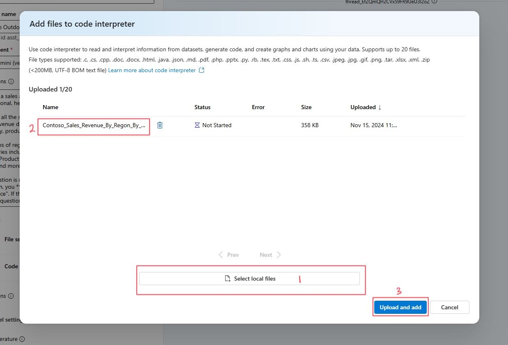
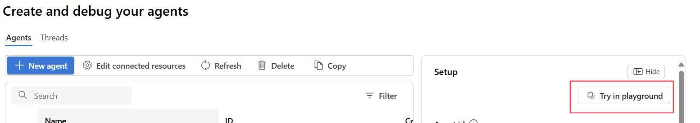

# Part 4 - Azure AI 에이전트

이 워크숍의 Part 4에 오신 것을 환영합니다!

지금까지 우리는 다양한 방식으로 대규모 언어 모델과 상호작용해왔습니다. 하지만 이러한 상호작용은 고립되어 특정 목적에 국한되었습니다. **Azure AI 에이전트**는 이러한 상호작용을 하나의 솔루션으로 통합하도록 도와주는 다음 단계입니다.

> [!TIP]  
> **Azure AI 에이전트란?**  
> Azure AI 에이전트는 개발자가 기본 컴퓨팅 및 스토리지 리소스를 관리할 필요 없이, 안전하게 고품질의 확장 가능한 AI 에이전트를 구축, 배포 및 확장할 수 있도록 설계된 완전 관리형 서비스입니다. 상태 관리, 컨텍스트 연결, 채팅 스레드, 코드 실행과 같은 기능을 통합하여 서드파티 확장 기능에 더 쉽게 접근할 수 있도록 지원합니다.

과거에는 맞춤형 AI 에이전트를 구축하려면 숙련된 개발자조차도 많은 노력이 필요했습니다. Chat completions API는 가볍고 강력하지만 본질적으로 상태가 없기 때문에, 개발자가 대화 상태와 채팅 스레드, 도구 통합, 문서 및 인덱스 검색, 코드 실행 등을 수동으로 관리해야 했습니다.

Azure AI Foundry 내에서 AI 에이전트는 질문에 답하거나(RAG), 작업을 수행하거나, 워크플로를 완전히 자동화할 수 있는 "스마트" 마이크로서비스 역할을 합니다. 이는 생성 AI 모델의 힘과 실제 데이터 소스에 접근하고 상호작용할 수 있는 도구를 결합하여 가능합니다.

에이전트는 필요에 따라 여러 도구에 병렬로 접근할 수도 있습니다. 이러한 도구에는 다음이 포함됩니다:
- **Function Calling**
- **Code Interpreter**
- **File Search**
- **Bing 검색 기반 Grounding**
- **Azure Functions** 등

이번 섹션에서는 Code Interpreter를 다룰 것입니다.

## 에이전트 구성 요소 이해하기

Azure AI 에이전트를 사용하려면, 에이전트의 기능에 참여하는 다양한 구성 요소를 이해하고 다루는 것이 중요합니다.

앞서 언급했듯이, **에이전트**는 질문에 답하거나(RAG), 워크플로를 자동화하거나, 작업을 수행할 수 있는 "스마트" 마이크로서비스입니다.

에이전트를 생성한 후 다음 단계는 **스레드(Thread)**를 생성하는 것입니다. **스레드**는 에이전트와 사용자가 대화하는 세션입니다. 스레드는 메시지를 저장하고 모델의 컨텍스트에 맞게 내용을 자동으로 잘라냅니다.

**메시지(Messages)**는 에이전트나 사용자가 생성하며, 텍스트, 이미지 및 기타 파일을 포함합니다. 이러한 메시지는 스레드에 리스트 형태로 저장됩니다.

마지막으로, 에이전트를 **실행(Run)**할 수 있습니다. 이는 스레드의 내용을 기반으로 에이전트를 활성화하여 실행하는 것을 의미합니다. 에이전트는 자신의 설정과 *스레드의 메시지*를 사용하여 모델과 도구를 호출해 작업을 수행합니다. 실행 중, 에이전트는 *메시지를 스레드에 추가*합니다.

## 에이전트 생성하기

1. 왼쪽 탐색 메뉴의 _Build and customize_에서 **Agents**를 선택합니다. 새로 열린 페이지에서 Azure OpenAI Service 리소스를 선택한 후 **Let's go** 버튼을 클릭합니다.


2. 새로운 에이전트가 이미 생성되어 있을 것입니다. **Deployments** 섹션에서 **gpt-4o-mini** 모델을 선택했는지 확인합니다.

    > [!TIP]  
    > **올바른 배포를 선택했는지 확인하세요.** **gpt-4o-mini**와 버전이 표시되어야 합니다.

3. 다음으로, 에이전트의 이름을 지정합니다. 에이전트 이름 텍스트 상자에 다음을 입력하세요:

    ```Contoso Outdoor Sales Agent```

4. 이제 에이전트에 **지침**을 제공할 수 있습니다. 이전 섹션에서 본 *System Message*와 유사하게, 에이전트가 따라야 할 목표를 제공합니다. **Prompt** 탭으로 이동하여 다음 지침을 지침 텍스트 상자에 복사하세요.

    ``` 
    You are a sales Agent for Contoso Outdoor. You are polite, professional, helpful and friendly.

    You get all the sales data from the uploaded .csv files. There is sales revenue data that is broken down by region, product category, product type and separated by year and month.

    Examples of regions include Africa, Asia, Europe and America. Categories include climbing gear, camping equipment, apparel and others. Product categories include jackets, hammocks, wet suits, shoes and more. 

    If a question is not related to sales or you cannot answer the question, you **must** respond: "Please contact IT for more assistance". If the user asks for help or says 'help', provide a list of sample questions that you can answer.
    ```

    

    > [!NOTE]  
    > 이전 섹션에서 배운 프롬프트 엔지니어링 기술 중 몇 가지를 이 프롬프트에서 식별할 수 있습니까? 힌트를 보려면 워크숍의 Part 2를 확인하세요.

5. **Actions** 탭으로 이동하여 **add**를 클릭합니다.

    

6. 새 탭에서 **Code interpreter**를 선택합니다.

7. 다음 창에서 **select local files**를 클릭하고 `Contoso_Sales_Revenue.csv` file on your Desktop.
    

    >[!NOTE]
    > If you cannot find the file on your desktop, you can download it from [here](../../../../lab/Workshop Instructions/assets/Contoso_Sales_Revenue.csv).

7. Click on the **upload and add** button. You should now see the file under the *Code Interpreter* tool.

The Agent is now ready for us to interact with it.

## Interacting with our Agent

1. On the top right of our Agents window, select **Try in playground**



2.  Let's begin by typing `help` 파일을 선택합니다. 채팅 상자에서 새로운 스레드가 시작됩니다.  
샘플 질문 몇 가지가 표시되는 것을 볼 수 있습니다. 질문 중 하나를 테스트하고 에이전트의 응답을 확인하세요!

8. 다음으로, 특정 쿼리를 시도해 봅시다. 다음을 입력하세요:

    ```What are the total sales for Europe broken down by category? ```

    에이전트가 코드 인터프리터를 사용해 답변을 제공하는 것을 확인할 수 있습니다.

9. 이제 이 데이터를 활용해 봅시다. 다음 프롬프트를 입력하세요:

    ```Put this data in a graph. ```

    코드 인터프리터를 통해 에이전트가 구조화된 데이터를 그래프로 변환하는 것을 볼 수 있습니다!

10. 다른 유형의 그래프를 보고 싶다면 다음 프롬프트를 시도하고 데이터를 그래프로 요청하세요:

    ```What is the trending product category? Give the output as a graph. ```

    에이전트가 판매 수익 데이터를 시간 경과에 따라 분석하여 트렌드 제품을 보여주는 그래프를 제공할 것입니다.

축하합니다! 이제 워크숍의 마지막 부분을 완료했으며, Azure OpenAI 에이전트가 무엇인지, 어떻게 작동하는지, Azure AI Studio를 사용하여 이를 생성하는 방법을 배웠습니다.

워크숍의 마지막 섹션으로 이동하세요: [요약](./07_Summary.md)

**면책 조항**:  
이 문서는 AI 기반 기계 번역 서비스를 사용하여 번역되었습니다. 정확성을 위해 노력하고 있지만, 자동 번역에는 오류나 부정확성이 포함될 수 있습니다. 원본 문서를 해당 언어로 작성된 상태에서 권위 있는 자료로 간주해야 합니다. 중요한 정보의 경우, 전문적인 인간 번역을 권장합니다. 이 번역 사용으로 인해 발생하는 오해나 잘못된 해석에 대해서는 책임을 지지 않습니다.