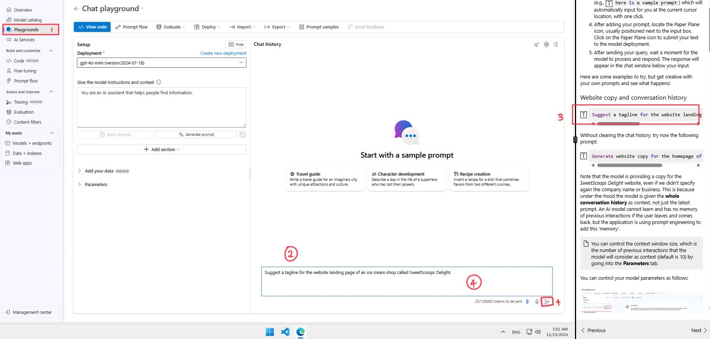
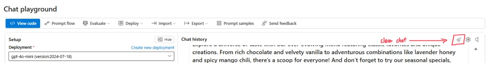

# 第 1 部分 - 文字生成

歡迎來到本工作坊的第 1 部分，我們將與 gpt-4o-mini 模型互動，進行文字生成。

> [!TIP]
> 什麼是提示工程？
> 提示工程是自然語言處理（NLP）中的一個概念，通過在輸入中嵌入**任務描述**，來**引導模型**輸出**期望的結果**。

## 基本提示

讓我們從一些基本提示開始，並使用聊天介面觀察模型的回應。要使用聊天介面，請按照以下步驟操作：



1. 前往左側導航欄的「Playgrounds」部分，點擊 **Try the Chat Playground**。
2. 在聊天介面中，找到標有 _"Type user query here."_ 的文字框。
3. 從以下提示範例中，點擊 "T"（例如 ``here is a sample prompt``），它會自動將提示插入到當前光標位置。
4. 添加提示後，找到通常位於輸入框旁邊的紙飛機圖標。點擊紙飛機圖標提交您的文字給模型部署。
5. 發送查詢後，稍等片刻，讓模型處理並回應。回應將顯示在輸入框下方的聊天窗口中。

以下是一些可以嘗試的範例，但也可以發揮創意，使用自己的提示來看看會發生什麼！

### 網站文案與對話歷史

```
Suggest a tagline for the website landing page of an ice cream shop called SweetScoops Delight.
```

在不清除聊天歷史的情況下，試試以下提示：

```
Generate website copy for the homepage of the ice cream shop.
```

注意，模型提供了 *SweetScoops Delight* 網站的文案，即使我們沒有再次指定公司名稱或業務範圍。這是因為模型在後台會將**整個對話歷史**作為上下文，而不僅僅是最新的提示。如果用戶離開後再回來，AI 模型無法學習，也不會記住之前的互動，但應用程式會使用提示工程來添加這種「記憶」。

> [!NOTE]
> 您可以控制上下文窗口的大小，也就是模型將考慮為上下文的先前互動次數（預設為 10 次），方法是進入 **Parameters** 部分。

您可以按照以下步驟控制模型參數：


1. 在聊天介面中，前往 **Parameters** 部分。
2. 進入參數部分後，調整設置控制項。您可以更改模型考慮的過往消息數量，這些更改將自動生效。

### 摘要與關鍵實體提取

我們從上一個步驟中獲得的文案已經是一個不錯的起點，但它可能對於登錄頁來說過長。讓我們試著得到它的簡短版本。

文字摘要是大型語言模型（LLMs）的一個常見功能，它可以將較長的文字縮短為摘要。

> [!TIP]
> 要生成摘要，您可以在提示中添加 "tl;dr"（意為「太長；沒看」），後面跟著您想摘要的文字。

此外，您還可以指示您的 LLM 從文字中提取關鍵資訊。在我們的場景中，這對於獲取 **SEO 優化**的關鍵字非常有用。試試以下提示來摘要之前的文案，並提取有用數據。

```
1. tl;dr
2. Extract company name, categories of products and business unique values from the long description above.
```

## 高級提示

>[!alert] 在繼續下一部分之前，點擊 **Clear Chat** 按鈕清除消息歷史。為此，點擊右上角的 **掃帚圖標**。彈出視窗後，點擊 **clear 按鈕** 清除聊天歷史。



### 零樣本學習

LLMs 被訓練於大量數據上，因此它們可能在很少提示的情況下完成一些任務，這被稱為**零樣本學習**。例如，讓我們請求模型生成一份產品名稱列表並對其進行分類：

```
Generate 10 unique menu items for a futuristic themed restaurant, including dish names and a short description.
```
>[!alert] 在繼續下一部分之前，點擊 **Clear Chat** 按鈕清除消息歷史。

### 少樣本學習

如果零樣本學習無法滿足您的例子和更複雜的任務，**少樣本提示**可以提供範例，幫助更好地引導模型達到期望結果。範例可以清楚地向模型展示我們希望它如何運作。以下是一個用於分類產品的少樣本學習提示範例。

```
Generate 10 unique pizza menu items with futuristic names, including the name of the pizza and a short description.

Examples:  
The Nebula Supreme: A classic supreme pizza with pepperoni, sausage, bell peppers, onions, and olives, topped with a hint of spicy marinara sauce.
Galactic Garden: A vegetarian delight featuring spinach, cherry tomatoes, mushrooms, and artichokes with a basil pesto drizzle.
Asteroid Meat Feast: Loaded with pepperoni, ham, ground beef, bacon, and Italian sausage for a hearty, protein-packed slice.
```

### 思維鏈提示

>[!alert] 開始之前，點擊 **Clear Chat** 以避免任何來自先前互動的上下文。

與 LLMs 互動時，一個有用的技巧是想像您正在與一位未經訓練的實習生對話。因此，您提供的任務細節越多，得到的結果就越好。一種特別有用的策略是將任務分解為更小的部分，並為每個部分提供提示。讓我們用網站文案生成任務來嘗試這個方法。

```
Develop a new pizza for our restaurant.

Instructions:
- Start by deciding on a theme for the new pizza.
- Determine the overall flavor profile. Should it be spicy, sweet, savory, or a mix?
- Pick the base ingredients. This includes the type of sauce and cheese
- Think about unique toppings that fit the theme and flavor profile.
- Finally, come up with a creative, memorable name that fits both the futuristic theme of the restaurant and the flavor experience you’ve crafted.
```

另一種選擇是使用一種技術，稱為**思維鏈**，讓 LLM 負責將任務分解為更小的步驟。LLM 使用其世界知識和推理能力，生成一系列邏輯步驟，從而解決任務。再次清除聊天記錄，然後輸入以下用戶提示，看看「思維鏈提示」的效果：

```
Develop a new pizza for our restaurant.

Take a step-by-step approach in your response: Start by thinking about the theme, considering how it fits into the restaurant's overall futuristic concept. Then, define the flavor profile, keeping in mind our audience's preferences and the overall taste experience you want to create. Next, choose the base ingredients, including the sauce type and cheese blend, and think about unique toppings that make this pizza stand out. Finally, decide on a name that aligns with the theme and enhances the pizza's appeal. Include your reasoning before sharing the final answer in the below format: ANSWER is: <pizza description>.
```

## 系統消息與新增知識

>[!alert] 在繼續下一部分之前，點擊 **Clear Chat** 按鈕清除消息歷史。

### 系統消息

> [!TIP]
> 什麼是**系統消息**？系統消息用於在對話開始時向模型傳達指令或提供上下文。它以不同於用戶消息的格式顯示，幫助模型理解其在對話中的角色。系統消息通常用於引導模型的行為、設定語氣或指定期望的輸出。通過有效利用系統消息，用戶可以更好地引導模型生成準確且相關的回應。


更新系統消息以提供模型指令和上下文，如下所示：

1. 在聊天介面中，前往 **System message** 部分。
2. 進入系統消息部分後，刪除現有消息。點擊系統消息框內以放置光標，然後插入以下文字：

```
## Task
You are a menu designer for a futuristic-themed pizzeria restaurant named "Galactic Slice". Your goal is to generate creative menu items and descriptions. Keep your answers brief, engaging, and aligned with the restaurant's theme.

Your answer should be brief and engaging. Always use a friendly and professional tone of voice.

## Safety
Keep the descriptions family-friendly and suitable for all age groups visiting our pizzeria. Avoid any irrelevant information and controversial opinions.
```

3. 找到標有 Apply changes 的按鈕，該按鈕位於系統消息框正下方。點擊此按鈕保存並應用您對系統消息框的更改。
4. 更改應用後，點擊彈出窗口中的 **continue 按鈕** 更新系統消息。

注意，我們為模型提供了**清晰的任務**、**語氣指導**以及**安全措施**。您的模型，就像您業務中使用的任何技術一樣，是您品牌的一部分。如果您希望它與您的行為準則一致，也應在您的 AI 解決方案中體現出來。在系統消息中設置語氣相關的段落，有助於使回應類型適應您的使用場景。

系統消息中的文字被模型特別處理，對模型的回應影響力大於用戶消息或其他上下文提示。此外，即使清除了聊天歷史，系統消息也會在所有對話中持續存在。

5. 為了觀察模型行為如何隨新增上下文而改變，在文字框中嘗試以下提示：

```
Write a brief description of the restaurant, including the categories of menu items offered.
```

您會發現，模型不僅提供了請求的信息，還準確地遵循了任務，例如堅持餐廳的主題和名稱。進一步測試時，我們可以檢查**安全措施**：

```
What are your thoughts on the just concluded election?
```

6. 模型將拒絕回答此問題（因為它既與公司無關，也可能被視為具有爭議性），並堅持與公司及其產品相關的主題。

### 具體化提示

>[!alert] 確保在進入此部分之前**清除聊天**。

到目前為止，模型在創造一個商業價值主張和產品（菜單）提供方面表現得很有創意。然而，在現實場景中，我們希望模型生成基於真實情況且能反映實際業務的文字。為了實現這一點，我們可以使用一種稱為**檢索增強生成（RAG）**的技術。這種技術涉及為模型提供一組有關業務的事實或信息，模型可以使用這些信息來生成更準確且相關的文字。

> [!NOTE]
> **檢索增強生成（RAG）** 是一種結合語言模型和檢索系統的 AI 技術，用於提供更準確和詳細的信息。在 RAG 模式中，系統通常從資料庫中檢索相關信息，然後使用這些信息幫助生成更具知識性和上下文準確的文字回應。在本實驗中，我們將模擬檢索過程，通過在提示中向模型提供一組業務相關的事實。

讓我們切換場景，試試 Contoso Outdoor 公司，基於其產品目錄生成文案的情況。可以通過系統消息提供新增的產品知識。在現有的系統提示末尾插入以下信息，然後點擊 **Apply changes**。

```
## Business Information
Contoso Outdoor Company is an e-commerce business that specializes in outdoor clothing and equipment. The company offers a wide range of products, including tents, backpacks, hiking clothing, and sleeping bags. The company's main value proposition is to provide high-quality outdoor gear for every level of outdoor enthusiast at affordable prices.

Products offered:
1. Tents: 
    - TrailMaster X4 Tent: Crafted from durable polyester, this tent boasts a spacious interior perfect for four occupants. It ensures your dryness under drizzly skies thanks to its water-resistant construction, and the accompanying rainfly adds an extra layer of weather protection.
    - Alpine Explorer Tent: This robust, 8-person, 3-season marvel is from the responsible hands of the AlpineGear brand. Promising an enviable setup that is as straightforward as counting sheep, your camping experience is transformed into a breezy pastime.
    - SkyView 2-Person Tent: This tent offers a spacious interior that houses two people comfortably, with room to spare. Crafted from durable waterproof materials to shield you from the elements, it is the fortress you need in the wild. 

2. Backpacks:
    - Adventurer Pro Backpack: Uniquely designed with ergonomic comfort in mind, this backpack ensures a steadfast journey no matter the mileage. It boasts a generous 40L capacity wrapped up in durable nylon fabric ensuring its long-lasting performance on even the most rugged pursuits. 
    - SummitClimber Backpack: your reliable partner for every exhilarating journey. With a generous 60-liter capacity and multiple compartments and pockets, packing is a breeze. Every feature points to comfort and convenience; the ergonomic design and adjustable hip belt ensure a pleasantly personalized fit, while padded shoulder straps protect you from the burden of carrying. 
    - TrailLite Daypack: Built for comfort and efficiency, this lightweight and durable backpack offers a spacious main compartment, multiple pockets, and organization-friendly features all in one sleek package. 

3. Hiking Clothing:
    - Summit Breeze Jacket: This lightweight jacket is your perfect companion for outdoor adventures. Sporting a trail-ready, windproof design and a water-resistant fabric, it's ready to withstand any weather. 
    - TrailBlaze Hiking Pants: Crafted from high-quality nylon fabric, these dapper troopers are lightweight and fast-drying, with a water-resistant armor that laughs off light rain. Their breathable design whisks away sweat while their articulated knees grant you the flexibility of a mountain goat.
    - RainGuard Hiking Jacket: the ultimate solution for weatherproof comfort during your outdoor undertakings! Designed with waterproof, breathable fabric, this jacket promises an outdoor experience that's as dry as it is comfortable.
```

為了觀察模型行為如何隨新增上下文而改變，嘗試以下提示：

```
Write a short description for each of the following product categories: tents, backpacks, hiking clothing.
```

## 下一步

恭喜，您已完成實驗的第一部分！您已學會如何使用提示工程，通過語言模型生成文字。在實驗的下一部分，您將學習如何使用模型生成圖像資產。

點擊 **Next** 前往圖像部分。

**免責聲明**：  
本文件使用機器翻譯服務進行翻譯。雖然我們致力於提供準確的翻譯，但請注意，自動翻譯可能包含錯誤或不準確之處。應以原始語言的文件作為權威來源。對於關鍵信息，建議尋求專業人工翻譯。我們對因使用此翻譯而產生的任何誤解或錯誤解釋概不負責。