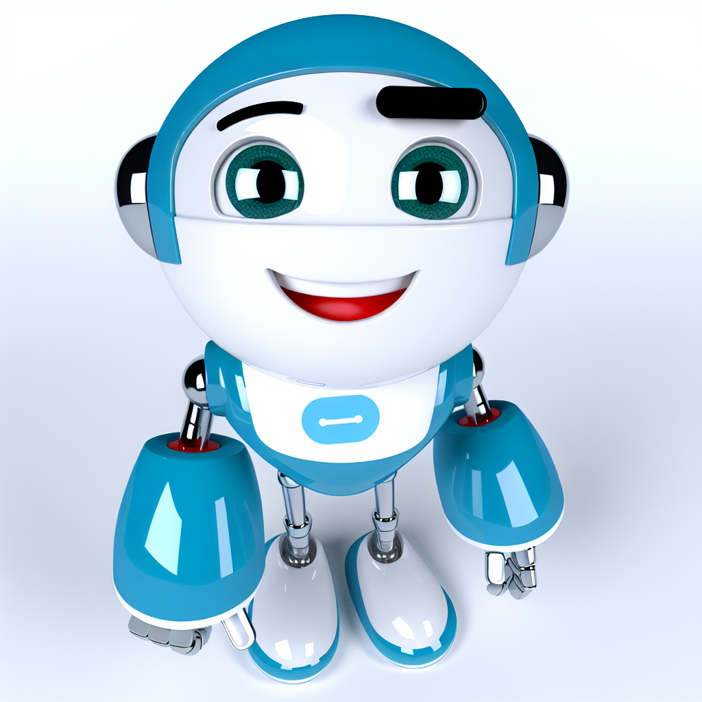
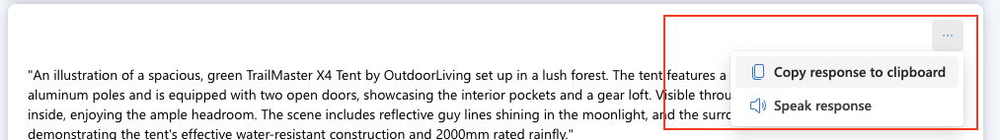

# 第2部分：图像生成

欢迎来到本次工作坊的第二部分，我们将与文本到图像模型 DALL-E 3 进行互动。

> [!TIP]
> 什么是 DALL-E 3？DALL-E 3 是一个基于神经网络的模型，可以根据**自然语言输入**生成图像数据。简单来说，你可以提供一个**描述**，DALL-E 3 会根据描述生成相应的图像。

## 创建你的第一张图像

按照以下步骤创建你的第一张图像：


1. 导航到左侧导航栏中的 **playgrounds**，然后选择 **Try the Image Playground**。
2. 在图像 playground 中，找到并点击标有 **Deployments** 的下拉菜单。从下拉列表中选择 **dall-e-3**。
3. 在图像 playground 中，找到标有 _"Describe the image you want to create."_ 的文本框。从下面的提示示例中，点击 "T"（例如 ``here is a sample prompt``），这将自动将内容输入到当前光标位置。
4. 输入描述后，会出现一个 **Generate** 按钮。点击按钮提交你的图像描述到模型部署。
5. 提交请求后，稍等片刻，模型将处理并响应。响应结果会显示在输入框下方的窗口中。

让我们从在描述框中输入一个基本提示并点击生成开始：

```a watercolor painting of Chicago skyline```

这将生成如下所示的内容：


DALL-E 3 生成的图像是原创的；它们并不是从某个图像库中检索的。换句话说，DALL-E 3 不是一个搜索系统，而是一个基于其训练数据生成新图像的人工智能（AI）模型。

### 提供具体描述

细节可以让生成的结果更准确。与文本生成类似，图像生成模型也非常依赖于详细的描述。

1. 例如，输入以下提示：

    ```A logo for an adventure brand```

2. 然后选择 **Generate**，查看生成的图像。

    

3. 现在，让我们通过在描述中添加更多细节来修改提示：

    ```A logo combining a tent silhouette and stars, with a rustic feel for an adventure brand.```

4. 再次选择 **Generate** 并比较结果。

    

### 最佳实践

为了使用 DALL-E 3 创建高效且准确的图像，请遵循以下最佳实践：

1. **清晰且详细的提示**：确保你的文本提示清晰且详细。描述越具体，DALL-E 3 就越有可能生成符合你要求的图像。包括主题、动作、环境、风格以及任何重要细节。
2. **使用形容词**：使用形容词和副词来描述你希望图像传达的特质、情感和特性。这有助于优化生成的图像，使其更符合你的愿景。
3. **细节与简洁的平衡**：虽然细节很重要，但过于复杂或矛盾的提示可能会让 AI 感到困惑，从而导致意外结果。找到一个平衡点，让你的描述既提供足够的上下文，又不过于冗长。
4. **尝试不同风格**：如果你希望图像具有特定的艺术风格或影响，请在提示中说明。例如，你可以要求生成一张艺术风格的图像。
5. **迭代方法**：通常，第一次生成的图像可能并不完美。将其作为起点，并根据输出迭代优化你的提示，以更接近理想结果。
6. **长宽比和构图**：如果你对图像的构图或长宽比有偏好，请在提示中说明。例如，你可以请求生成横向的图像或主体偏离中心的肖像。
7. **文化和上下文参考**：如果合适，可以包括文化或历史参考，以提供额外的上下文，帮助指导图像生成过程。
8. **负责任的 AI 使用**：注意提示的负责任 AI 使用。避免生成冒犯性、加深刻板印象或侵犯版权的图像。
9. **测试与学习**：尝试不同的提示，了解 DALL-E 3 如何解释各种描述。这个学习过程可以帮助你随着时间的推移提高提示的精准度。
10. **遵循指南**：在创建提示时遵守 OpenAI 的使用政策和内容指南。避免请求生成不符合 OpenAI 内容政策的图像。

## 品牌吉祥物创作

在本次工作坊中，我们将利用 DALL-E 3 的能力为品牌吉祥物生成图像，重点关注不同主题，例如友好的动物、机器人或抽象形象。

我们还将测试 DALL-E 3 的不同参数，以探索生成图像的多样性。这些参数包括：

- **图像大小**：尝试不同的大小（例如，正方形、横向、纵向），以了解图像尺寸如何影响吉祥物在各种活动中的设计和适用性。
- **图像风格**：尝试不同的风格，如自然或鲜艳，看看哪种风格最符合品牌的个性。
- **图像质量**：调整质量设置以生成适合打印的高分辨率图像，或适合网页或社交媒体使用的低分辨率版本。大小可以是高清（HD）或标准。

1. 让我们从生成一个品牌吉祥物开始。考虑以下提示：

```A friendly robot mascot with a smiling face, designed in a cartoon style.```



```A playful fox mascot with a colorful scarf, representing agility and creativity.```

```An abstract figure with geometric shapes, conveying innovation and technology.```

2. 在 playground 中，点击 _省略号图标_ 并导航到 Settings。
3. 在每个部分下，点击 _下拉箭头_ 来更改参数。
4. 使用更新的设置再次尝试这些提示。

## 高级提示设计

现在我们已经了解了一些基本提示，接下来尝试一些新的内容。

>[!alert] 确保系统消息为空。如有需要，可以点击 **Reset to Default** 恢复默认设置。

我们现在将尝试基于 gpt-4o-mini 生成的提示来生成图像。

1. 返回到 **Chat Playground**。

2. 在 **System message** 中，清除 **Give the model instructions and context** 旁边的现有消息，将系统消息重置为默认。

3. 在 **聊天框** 中，输入我们希望为其创建图像的产品的详细描述，并提交请求给模型。

```
Generate a prompt for DALL-E 3 from this product description:

The 3D Animated Office Space Design by CreativeSpaces offers a modern, interactive representation of a professional work environment. This design concept includes ergonomic furniture, open and collaborative workspaces, greenery for a touch of nature, and large windows to maximize natural light. The layout also incorporates meeting pods, hot desks, and breakout areas for different work modes. The office has a neutral color palette, with accents of green and blue to create a calming yet productive atmosphere.

The 3D Animated Office Space Design is intended for use by architects, interior designers, and companies looking to revamp their workspaces. It highlights the importance of balancing privacy with collaboration, including quiet zones for focused work and shared areas for team interactions. The space features modern materials like glass and wood, combined with innovative lighting solutions to enhance productivity and employee well-being.

Beyond its aesthetic appeal, the 3D Animated Office Space Design is designed with functionality in mind. It includes ample storage solutions, acoustic panels to reduce noise, and modular furniture that can be rearranged to suit different needs. The green walls and potted plants throughout the office create a refreshing environment that promotes creativity and reduces stress. The design is presented in a high-quality 3D animation, providing a realistic walkthrough that allows clients to visualize the space effectively.
```

4. 一旦收到响应，点击响应顶部的三点图标，然后点击 **Copy response to clipboard**。



5. 返回到 **Images playground**，从提示响应生成图像。

6. 在图像 playground 中，**确保在 Deployments 下选择 'dall-e-3'**，然后将生成的提示粘贴到 **Prompt Box**。

7. 点击 **Generate**，观察生成的图像有多详细。


## 下一步

恭喜！你现在已经完成了实验的第二部分，并生成了不同的图像素材。在实验的下一部分，你将学习如何使用模型进行多模态请求。

点击 **Next** 进入多模态部分。

**免责声明**：  
本文档是使用基于机器的人工智能翻译服务翻译的。尽管我们努力确保翻译的准确性，但请注意，自动翻译可能包含错误或不准确之处。应以原始语言的文档作为权威来源。对于关键信息，建议寻求专业人工翻译。我们对于因使用此翻译而导致的任何误解或误读不承担责任。