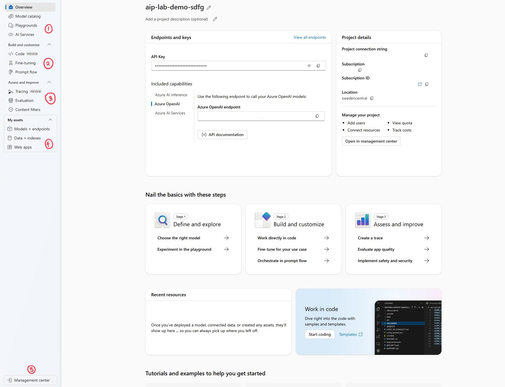
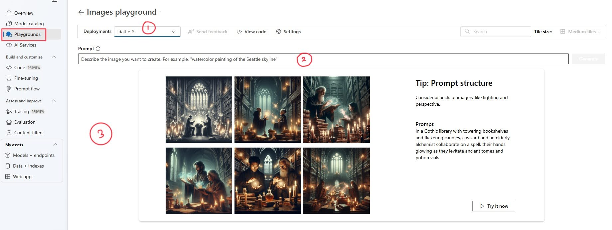
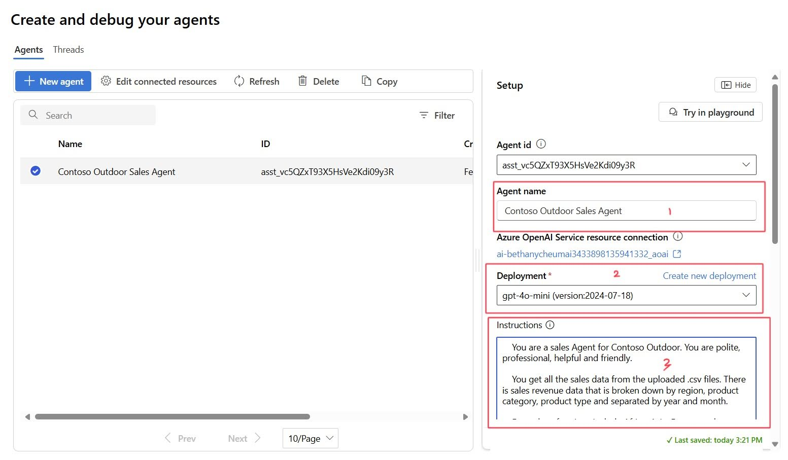

# 入门

> [!TIP]
> 什么是 **Azure AI Foundry**？Azure AI Foundry 是为创新者打造未来的终极平台。它提供了一整套 Azure AI 功能和工具，用于设计、定制和管理 AI 应用程序和代理。它与全球最受欢迎的开发工具（包括 GitHub、Visual Studio 和 Copilot Studio）无缝集成。Azure AI Foundry 让开发人员和 IT 管理员能够轻松高效地实现他们的 AI 构想。

## 前置条件

完成本实验需要以下条件：

- 一个 Azure 订阅 - [免费创建一个](https://azure.microsoft.com/free/cognitive-services?WT.mc_id=aiml-132569-bethanycheum)。
- 一个 Azure OpenAI 资源，其中 [GPT-4o 和 DALL.E 3 模型可用于支持的区域](https://learn.microsoft.com/en-us/azure/ai-services/openai/concepts/models#assistants-preview?WT.mc_id=aiml-132569-bethanycheum)。

## 部署您的资源

在本次研讨会中，我们将使用 Azure AI Foundry。首先，请按照以下步骤部署必要的资源：

1. 点击“部署到 Azure”按钮以部署您的资源：

2. 在新打开的标签页中，登录您的 Azure 账户。

3. 登录后，您将被重定向到基于自定义模板创建资源的页面。创建一个新的资源组，并命名为 **interact-with-llms**。

4. 接下来，在 **Unique Suffix** 字段中添加任意四个唯一字母。完成后，点击 **Review and Create** 按钮创建资源。

> [!NOTE]
> 资源部署大约需要 2-3 分钟完成。

5. 在本次研讨会中，我们将使用 Azure AI Foundry，特别关注其中的 Playground 功能。部署完成后，在浏览器中访问 [Azure AI Foundry](https://ai.azure.com?WT.mc_id=aiml-132569-bethanycheum)。

## 浏览 Azure AI Foundry

1. 首先，导航到左侧边栏，找到 **Management** 部分。在该部分下，选择 **All Resources**。此操作将带您进入一个集中区域，显示所有可用资源和工具，提供当前中心连接的概览。

> [!NOTE]
> 如果找不到 **All Resources** 部分，请点击 **All hubs** 部分。

2. 在可用中心列表中找到 **Workshop AI Hub**。**点击该中心的项目**以访问其设置和资源。

## 项目

### 项目概览

在此页面，我们可以看到 Azure AI Foundry 门户项目的概览，包括：
- **项目名称和描述**：项目的名称以及 Azure AI Foundry 门户项目的简短描述。
- **项目详细信息**：包括项目的连接字符串、位置、资源组等各种属性的集合。
- **端点和密钥**：Azure AI Foundry 门户允许多个资源与其连接，从而扩展其功能。这些资源（如 Azure OpenAI、Azure AI Search 和 Azure AI Services）进一步增强了项目的能力，使我们能够访问部署（如 LLMs）或功能（如向量搜索）。在这里，我们可以找到 *API 端点和密钥* 以及相关文档。
- **最近的资源和教程**：在此部分，您最近使用的资源会被突出显示，同时提供额外的学习资源和教程以帮助您快速入门。

### 导航栏

您会注意到导航栏更新了新标签，这些标签代表与项目相关的功能。

我们有以下几个新部分：
1. 第一部分包括 _Playgrounds_（与模型互动）、_Overview_（项目概览）、_Model Catalog_（展示 Azure AI Foundry 内可用的模型）和 _AI Services_（列出可用的 Azure AI 服务，包含演示、用例等）。
2. **Build and Customize**：提供扩展项目范围的机会，例如通过运行云计算来 _working in Code_、访问 [_Prompt Flow_](https://learn.microsoft.com/en-us/azure/ai-studio/how-to/prompt-flow)，以及对您的部署进行 _Fine Tuning_。
3. **Assess and Improve**：包括开发模型的 _Evaluations_、调试流程的 _Tracing_ 和为提示输入及输出添加防护措施的 _Content Filters_。
4. **My assets**：在这里，您可以为项目添加额外的元素，如 _Data_、_Indexes_、_Models and Endpoints_ 和 _Web Apps_。
5. **Management Center**：用于管理所有中心和项目的详细信息及资源的地方。

在本实验中，我们将重点使用 **Playgrounds**，导航到 Playgrounds 并继续下一部分。

## Playgrounds

您会注意到 **Playground** 提供了不同的选项。每个选项代表一种与 AI 模型互动和使用的方式，可根据具体需求进行定制。

我们将在这些 Playgrounds 中完成大部分工作，主要包括以下几个：

1. **Chat Playground**
2. **Images Playground**
3. **Real-time audio playground**
4. **Agents playground**

### Chat Playground

在 Playground 部分，导航到 **Chat playground** 并选择 **Try the Chat Playground**。此功能允许您以对话形式与各种 AI 模型互动和测试。

1. **Deployment**：此部分允许我们在已部署的模型之间切换。
2. **System Message Box**：在用户互动之前，这里是为模型输入指令的地方。
3. **Add your data**：Azure AI Foundry 门户支持为已部署的模型提供外部数据，从而实现更好的搜索和上下文支持。
4. **Parameters**：此标签包含模型的详细设置，如温度。
5. **Chat Box**：聊天框显示我们与模型的交互内容，以聊天消息的形式呈现。
6. **Prompt Box**：这是我们向模型发送提示的地方。

### Images Playground

返回 Playgrounds，选择 **Image playground** 并点击 **Try the Image Playground**。此选项允许您进行图像生成。

1. **Deployments**：在此下拉菜单中，我们可以选择用于图像生成的模型。这些模型与聊天模型一样，来源于我们的部署。
2. **Prompt Box**：与聊天 Playground 的提示框类似，这是用户输入生成图像描述的地方。
3. **Results Box**：最终生成的图像会显示在这里。

### Real-time audio playground

返回 Playgrounds，然后选择 **Real-time audio playground** 并点击 **Try the Real-time audio Playground**。此功能允许您以音频对话形式与各种 AI 模型互动和测试。

1. **Deployment**：此部分允许我们在已部署的模型之间切换。
2. **Server turn detection**：决定服务器是否使用语音活动检测（VAD）来识别用户何时完成讲话。
3. **System Message Box**：在用户互动之前，这里是为模型输入指令的地方。
4. **Choose a voice**：gpt-4o-realtime 提供多种语音选择，具有独特的口音或语调能力，可根据您的喜好定制。
5. **Server turn detection**：额外参数可通过优化语音活动检测提高模型的效率和性能。
6. **Parameters**：此标签包含模型的详细设置，如温度和最大响应。
7. **Prompt Button**：与聊天 Playground 的提示框类似，这是模型获取用户输入的地方。

## Agents playground

在导航栏中选择 **Agents**。此功能为您提供了构建、测试和定制 AI 驱动代理的工具。

一旦您 _创建第一个 Agent_，界面组件如下：
1. **Agent id 和名称**：您可以为 Agent 命名。
2. **Deployment**：在此下拉菜单中，我们可以选择用于图像生成的模型。这些模型与聊天模型一样，来源于我们的部署。
3. **Instructions Box**：在用户互动之前，这里是为模型输入指令的地方。

4. **Knowledge**：为代理提供访问数据源的能力，用于提供更可靠的响应。
5. **Actions**：通过允许代理在运行时执行各种工具，增强其能力。
6. **Model settings**：此标签包含模型的详细设置，如温度和 Top P。
7. **Prompt Box**：与聊天 Playground 的提示框类似，这是用户输入的地方。

## 准备开始

以上是 Azure AI Foundry 的必要设置和基础知识。接下来，我们将开始与模型互动。

返回 **Project Playground** 下的 **Chat** 并点击说明中的 Next，继续进入 Part 1: Text Generation。

> [!IMPORTANT]
> 返回 **Chat Playground** 并进入 [Part 1: Text Generation](./02_Text_Generation.md)。

**免责声明**:  
本文档使用基于机器的AI翻译服务进行翻译。尽管我们尽力确保准确性，但请注意，自动翻译可能包含错误或不准确之处。应将原始语言的文档视为权威来源。对于关键信息，建议使用专业人工翻译。因使用本翻译而引起的任何误解或误读，我们概不负责。